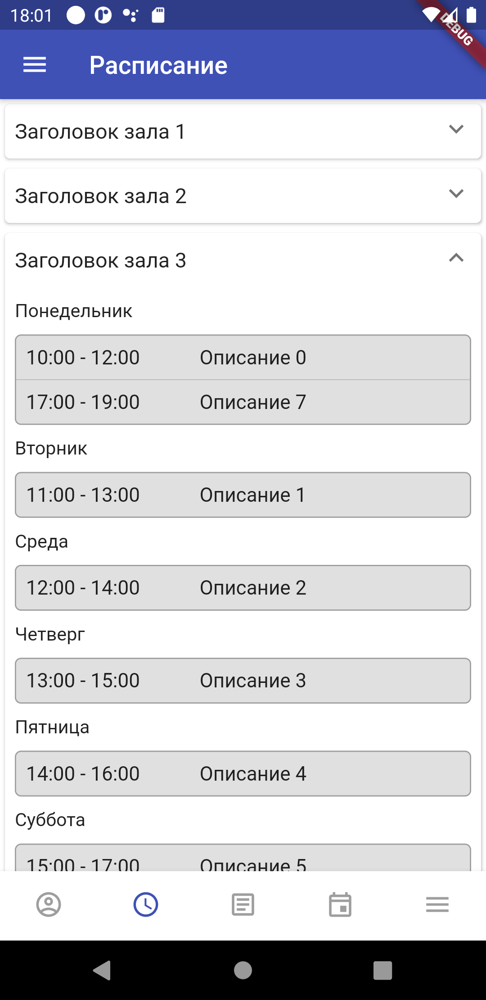

# OpenKarateApp

Мобильное приложение для спортивного клуба

Это версия с открытым исходным кодом. Из нее убраны упоминания и символика
спортивного клуба, для которого изначально предназначался проект.

Приложение создано на фреймворке для разработки кросплатформенных приложений Flutter.

На данный момент приложение тестировалось только на устройствах с ОС Android.

## Скриншоты

<table>
  <tr>
    <td>
            
      
Background image by <a href="https://pixabay.com/users/anniespratt-4900708/">Annie Spratt</a> from <a href="https://pixabay.com/">Pixabay</a>

    </td>
    <td></td>
  </tr>
  <tr>
    <td></td>
    <td>
Фильтр событий
</td>
  </tr>
  <tr>    
    <td></td>
    <td></td>
  </tr>
</table>
