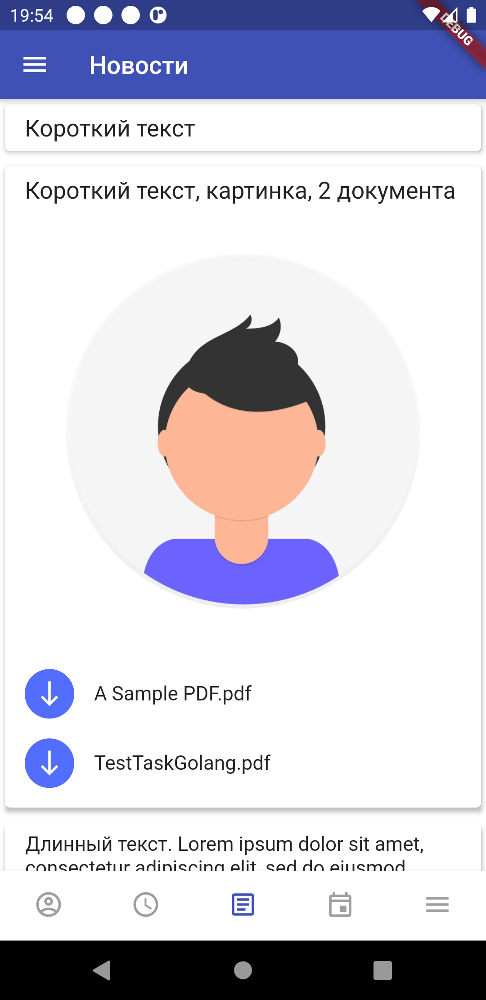
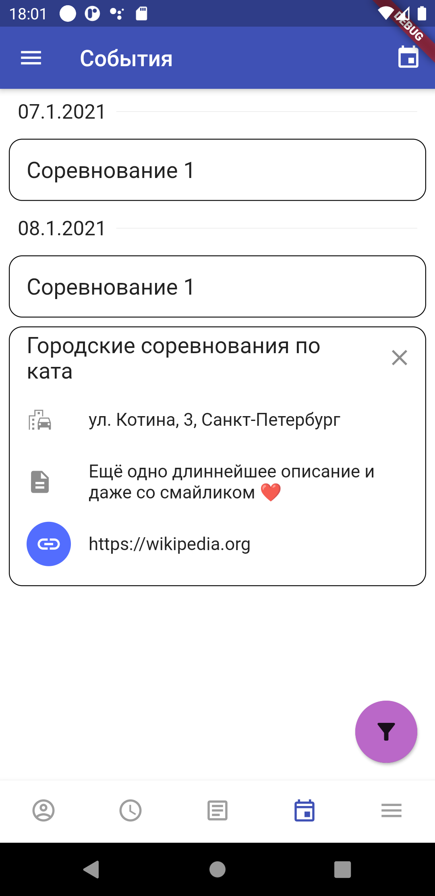

# OpenKarateApp

Мобильное приложение для спортивного клуба

Это версия с открытым исходным кодом. Из нее убраны упоминания и символика
спортивного клуба, для которого изначально предназначался проект.

Приложение создано на фреймворке для разработки кросплатформенных приложений Flutter.

На данный момент приложение тестировалось только на устройствах с ОС Android.

## Скриншоты

Background mage by [Annie Spratt](https://pixabay.com/users/anniespratt-4900708/) from [Pixabay](https://pixabay.com/)

